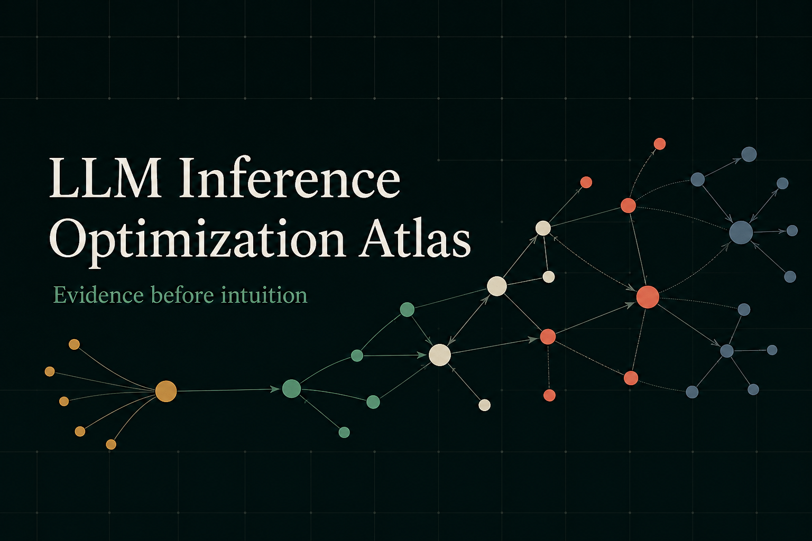

# LLM Inference Optimization Atlas



A schema-first, Git-native evidence base for deciding how to run LLM inference.

The Atlas records reproducible experiments across realistic workloads, models,
hardware, runtimes, and serving configurations to answer one practical question:

> Given a workload, quality contract, SLO, model, and hardware topology, which
> inference configuration should be deployed, when does it work, and why?

```text
Workload -> Hypothesis -> Experiment -> Run -> Comparison
         -> Finding -> Decision -> Evidence Graph
```

The repository is the database. Canonical JSON Schemas freeze the contracts,
YAML records preserve human reviewability, accepted evidence remains in Git, and
a deterministic compiler materializes global and per-study interactive graphs.

## V1 at a glance

The V1 bootstrap is implemented and locally exercised:

- 38 Draft 2020-12 schemas with closed core objects and namespaced extensions.
- Six workload archetypes, eight traffic regimes, 25 bottlenecks, 112 optimization
  techniques, 96 metrics, and 32 graph relations.
- 108 authoritative external source records, kept separate from Atlas evidence.
- Three approved, real-model Apple M3 CPU studies spanning Transformers/PyTorch,
  llama.cpp HTTP serving, ONNX Runtime, native execution, and Docker.
- 87 accepted full-profile runs, 17 paired-bootstrap comparisons, 17 findings,
  and three deployment decisions.
- A Python CLI plus a static React/TypeScript/Cytoscape evidence explorer.

The measured findings are deliberately narrow. They establish behavior for the
exact model, runtime, hardware, and fixtures recorded by each run; they are not
universal optimization claims.

## Repository map

- `reference/`: versioned schemas, ontology, protocols, sources, and templates.
- `registry/`: reusable datasets, evaluators, immutable model revisions, hardware,
  and runtime builds.
- `studies/`: proposals, configurations, execution bundles, accepted runs,
  comparisons, findings, and decisions.
- `src/atlas/`: validation, execution, comparison, graph, and site tooling.
- `site/`: static interactive Atlas application.
- `docs/`: architecture, concepts, reproduction, and contribution guides.
- `build/`: ignored generated graph, source catalog, bibliography, and site output.

There is no `reference/examples/`. Reusable empty structure belongs in
`reference/templates/v1`; realistic examples are first-class studies and follow
the same proposal and evidence-review process as every future contribution.

## Quick start

Requirements: Python 3.12, [uv](https://docs.astral.sh/uv/), Node.js 24, npm,
and Docker for S002/S003 execution.

```bash
make setup
uv run atlas doctor
make check
uv run atlas site build
uv run atlas graph serve
```

The local explorer starts at the Story view. Per-study routes are stable, for
example:

```text
/studies/S001-cpu-interactive-chat/v1/
/studies/S002-cpu-coding-agent/v1/
/studies/S003-cpu-enterprise-rag/v1/
```

Validation and ordinary CI never download model weights. A study’s explicit
`execution prepare` step shows artifact sizes and licenses, then stores verified
files under the ignored `.atlas/cache/` directory.

## Real CPU studies

| Study | Execution path | Full runs | Selected exact-setup configuration |
|---|---|---:|---|
| S001 interactive chat | SmolLM2 / Transformers CPU | 30 | Warm, batch 1, one inference thread |
| S002 coding agent | Qwen2.5-Coder GGUF / llama.cpp | 30 | Warm prefix reuse, four threads, one slot |
| S003 enterprise RAG | MiniLM ONNX + SmolLM2 | 27 | Native FP32, top_k 3, precomputed documents |

See [studies/README.md](studies/README.md) for execution commands and study
boundaries. Model weights, caches, container layers, and generated site output
are never committed.

## Research principles

- Evidence over anecdotes.
- Quality-constrained performance, not unqualified throughput.
- Explicit workload, SLO, configuration, unit, and provenance contracts.
- Identical seeds and inputs for controlled paired comparisons.
- Negative and inconclusive results retained alongside positive findings.
- External sources explain concepts but never substitute for Atlas runs.
- Exact-setup confidence and transferability recorded separately.
- Correlation never silently promoted to causality.

Start with [the documentation map](docs/README.md),
[the reproduction guide](docs/guides/reproduce-a-study.md), and
[CONTRIBUTING.md](CONTRIBUTING.md).

## License

Apache License 2.0. External datasets, model artifacts, papers, and software
retain their upstream licenses and are not redistributed unless their terms
permit it.
